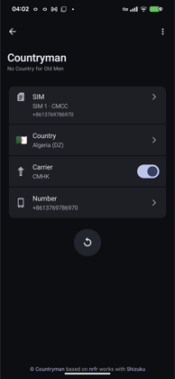
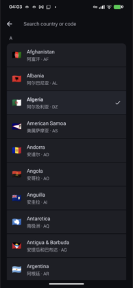
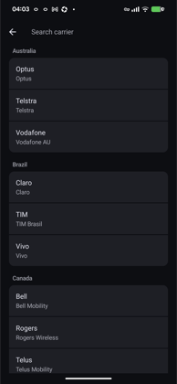

# Countryman

**No Country for Old Men**

一个用于调整 SIM 国家、运营商名称和号码显示的 Android 小工具。

Countryman 是一个面向个人使用的 Android SIM 显示配置工具。它不改写实体 SIM，也不依赖 Root、Magisk 或 Xposed，而是通过 Shizuku 调用系统能力，调整系统展示层读取到的：

- 国家
- 运营商
- 号码

它适合用于个人设备上的区域兼容测试和日常自用调试，不是“万能伪装器”。实际效果取决于 Android 版本、厂商 ROM 和目标应用读取信息的方式。

Android 16 设备需要同时安装 `Countryman Broker`。Broker 用于承接系统写入动作，避免主界面在写入时被系统 instrumentation 流程打断。

## 截图

| Main | Country | Carrier |
| --- | --- | --- |
|  |  |  |

## 功能

- 支持双卡设备分别配置
- 支持国家显示覆盖
- 支持运营商名称覆盖
- 支持订阅显示号码设置
- 支持一键还原
- 兼容 Android 16
- 支持中文和英文界面

## 实现原理

Countryman 通过 Android 系统的 SIM 订阅信息和运营商配置相关接口写入覆盖结果，而不是修改 SIM 卡本身。

这意味着：

- 不会写坏实体 SIM
- 修改的是系统展示层或配置层结果，不是底层卡数据
- 能否生效取决于系统、厂商实现和目标应用的取值路径
- 所有覆盖都可以撤销

## 使用前提

- Android 8 及以上
- 已安装并启用 Shizuku
- 已开启开发者选项和 USB 调试
- 设备本身允许当前接口路径生效

## 快速开始

1. 在手机上安装并启动 Shizuku。
2. 安装 `Countryman`。
3. Android 16 设备额外安装 `Countryman Broker`，并打开一次完成初始化。
4. 在 Countryman 中选择 SIM 卡。
5. 选择国家、运营商或号码后会自动写入。
6. 需要恢复默认状态时，使用右上角的 reset 操作。

## Android 16

Android 16 上，系统会拒绝旧的 shell 风格 `overrideConfig` 写入路径，常见错误为：

```text
override config cannot be invoked by shell
```

Countryman 当前使用主 App + Broker 的方式处理这个限制：

- `Countryman` 作为主界面 App
- `Countryman Broker` 作为 Android 16 helper
- Shizuku 仍然是权限桥
- Broker 承担 instrumentation 写入副作用，主界面保持在前台

技术说明见：

- [docs/android16-broker-notes.md](docs/android16-broker-notes.md)

## 构建

项目包含两个 Android 模块：主应用 `app` 和 Android 16 helper `broker`。

```bash
./gradlew :app:assembleDebug :broker:assembleDebug
```

输出位置：

- 主应用 APK：`app/build/outputs/apk/`
- Broker APK：`broker/build/outputs/apk/`

## 依赖

- [Shizuku](https://shizuku.rikka.app/)
- [ADB](https://developer.android.com/tools/adb)
- Android Gradle Plugin
- Jetpack Compose Material 3

## 注意事项

- 不同厂商 ROM 的行为差异很大
- 某些接口只能改“显示层”，不能改真实底层值
- 某些目标应用会直接读取更底层的信息，覆盖未必生效
- IMS 号码等底层号码通常不能在非 Root / 非系统权限下修改
- 使用前最好先确认默认值，便于判断覆盖是否生效

## 免责声明

本工具仅供学习、研究和个人设备测试使用。由此带来的兼容性、服务异常或其他后果需自行承担。

## 许可证

本项目基于[nrfr](https://github.com/Ackites/Nrfr)开发，采用同样的 [Apache-2.0](LICENSE) 许可证。

## Copyright

© [Countryman](https://github.com/cloudinstone/countryman) based on [nrfr](https://github.com/Ackites/Nrfr), works with [Shizuku](https://shizuku.rikka.app/).
